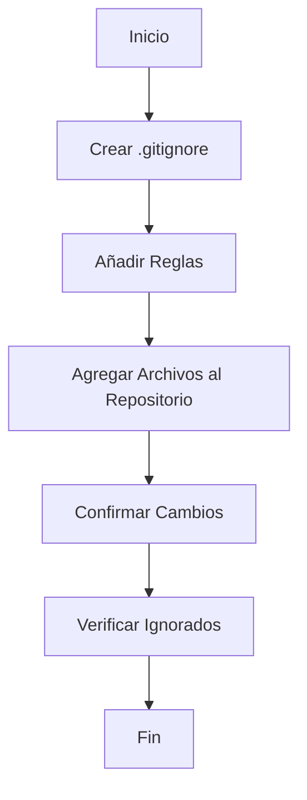

```markdown

Manual para Usar el Archivo .gitignore
Este manual está diseñado para ayudar a entender y utilizar el archivo .gitignore en tus proyectos.

¿Qué es un archivo .gitignore?
El archivo .gitignore es un archivo de texto que le dice a Git qué archivos o directorios deben ser ignorados en un repositorio. Esto es útil para evitar que archivos temporales, de configuración personal o generados automáticamente se incluyan en tu control de versiones.

¿Por qué usar un archivo .gitignore?
Mantener el repositorio limpio: Evitar incluir archivos innecesarios.
Privacidad: No subir archivos de configuración personal o información sensible.
Eficiencia: Reducir el tamaño del repositorio ignorando archivos grandes o innecesarios.
¿Cómo crear un archivo .gitignore?
Crear un archivo .gitignore en la raíz de tu repositorio:

Abre tu proyecto en VSCode (o cualquier editor de texto).
Crea un nuevo archivo y nómbralo .gitignore.
Añadir reglas al archivo .gitignore:

Cada línea en el archivo .gitignore es una regla que le dice a Git qué archivos o directorios ignorar.
Sintaxis básica del archivo .gitignore
Ignorar archivos específicos: Escribe el nombre del archivo.
```plaintext
archivo.txt
```
Ignorar todos los archivos con una extensión específica: Usa el comodín *.
```plaintext
*.log
```
Ignorar un directorio específico: Añade una barra diagonal / al final del nombre del directorio.
```plaintext
logs/
```
Ignorar archivos en cualquier lugar del proyecto: Usa **/.
```plaintext
**/archivo.txt
```
Ejemplos comunes de .gitignore
Aquí tienes un archivo .gitignore típico que podrías usar en un proyecto de desarrollo web con Visual Studio, Node.js y Reveal.js:

```plaintext

Archivos y directorios específicos del sistema operativo
.DS_Store
Thumbs.db

Logs
*.log

Dependencias de Node.js
node_modules/

Directorios de construcción
dist/
build/

Archivos temporales
*.tmp
*.bak

Configuración de Visual Studio
.vs/
*.suo
*.user
*.userosscache
*.sln.docstates

Archivos de Python
pycache/
*.py[cod]

Puntos de control de Jupyter Notebook
.ipynb_checkpoints/

Archivos específicos de Reveal.js
reveal.js/node_modules/
reveal.js/dist/
reveal.js/build/
reveal.js/plugin/markdown/marked.js
reveal.js/plugin/markdown/markdown.js
```

Cómo aplicar .gitignore a archivos ya versionados
Si ya has añadido archivos al control de versiones y luego los añades al .gitignore, necesitas decirle a Git que los ignore:

Eliminar los archivos del seguimiento sin borrarlos del proyecto:
```bash
git rm -r --cached .
```
Añadir los cambios:
```bash
git add .
```
Confirmar los cambios:
```bash
git commit -m "Actualizar .gitignore y eliminar archivos del seguimiento"
```
Verificar si un archivo está siendo ignorado
Puedes verificar si un archivo está siendo ignorado por Git usando el siguiente comando:

```bash
git check-ignore -v nombre_del_archivo
```

Resumen
Crea un archivo .gitignore en la raíz de tu proyecto.
Añade reglas para ignorar archivos y directorios innecesarios.
Confirma y sube tus cambios al repositorio.
Verifica que Git está ignorando los archivos correctamente.
Diagrama de Flujo del Uso de .gitignore

```